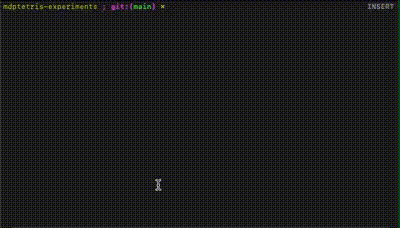

# MdpTetris experiments

This repository holds the agents and experiments to be run on 
[`gym-mdptetris`](https://github.com/Benjscho/gym-mdptetris).

## Installation

This repository can be installed via GitHub:
```bash
pip install git+https://github.com/Benjscho/mdptetris-experiments
```
Or by cloning to the desired directory, `cd`-ing into the directory and 
running `pip install -e .`.

## Run experiments

Below are commands to get started with running the agents provided. Further
commands used can be found in
`./mdptetris_experiments/experiments/experiment-commands.md`. 

### Linear agent

The linear agent can be run with the default weights created by Pierre 
Dellacherie using `python mdptetris_experiments/agents/linear_agent.py render`. 
This agent is very effective at clearing lines, so this can take some
time to run.

This agent is very successful:
<p align="left">
    
</p>

To customize the weighting of the agent, a new instance can be created:

```python
import numpy as np
from mdptetris_experiments.agents.linear_agent import LinearGame

agent = LinearGame(weights=np.array([-1, 1, -1, -1, -4, -1]))
cleared = agent.play_game()
print(f"{cleared:,} rows cleared")
```

### MBDQN 

The model-based DQN agent utilises a similar approach to the linear agent,
generating all of the possible subsequent states before using a neural network
to evaluate the value of each board state. This agent performs at a poor level 
but demonstrates learning after 3000 epochs.

To train the agent with default settings simply run:
```bash
python mdptetris_experiments/agents/MBDQN/train.py
```

A trained agent can then be tested by providing it with a model load file:
```bash
python mdptetris_experiments/agents/MBDQN/train.py --test --render --load_file <LOAD_FILE_PATH>
```

The agent has a number of hyperparameters that can be varied via input from the
command line.  You can view these by running the program with the `-h` or
`--help` parameter:
```bash
python mdptetris_experiments/agents/MBDQN/train.py -h
```

For example, to run the one piece per episode training experiments, where each
episode only drops one of the 7 Tetris pieces, you can use the `--one_piece` 
option. To specify which GPU to use while training use the option
`--gpu=<GPU-ID-HERE>`. To vary the board height, use `--board_height=10`.

### PPO

The PPO-Clip agent is a model-free agent that learns through interaction with
the environment.  To train the agent with default settings run:
```bash
python mdptetris_experiments/agents/PPO/train.py
```

Similarly to the MBDQN agent, there are a number of hyperparameters that can be
varied through command line options. You can see the available options by
running with the `-h` parameter:
```bash
python mdptetris_experiments/agents/PPO/train.py -h
```